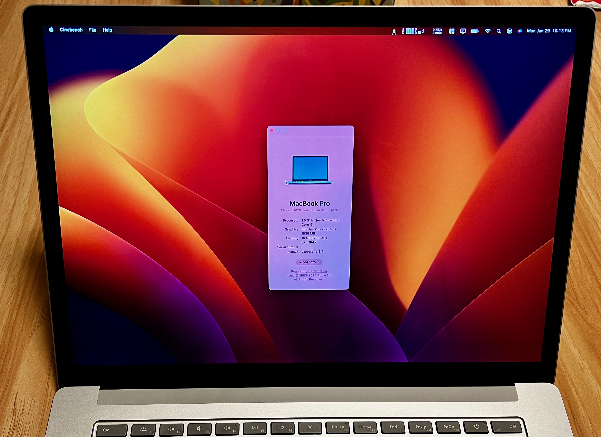

# Surface Laptop 3 15" OpenCore EFI for macOS Ventura

<!-- add github tags here -->

| **Surface Laptop 3 15"** | **macOS Ventura** |
| ------------- | ------------- |
|  | |

## Features

* Running macOS Ventura 13.6.4 without major issues. 
* Support Bluetooth 4.0+ devices with the solution provided by [this issue](https://github.com/OpenIntelWireless/IntelBluetoothFirmware/issues/51). 

## Hardware

* **CPU**: Intel Core i5-1035G7
* **iGPU**: Intel Iris Plus Graphics G7
* **Memory**: 16 GB 3733 MHz LPDDR4X
* **Storage**: 256 GB NVMe SSD HFM256GDGTNG-87A0A
* **Display**: 15" 2496x1664

## Current status

| Component | Status | Notes |
| --------- | ------ | ----- |
| CPU | ✅ | |
| iGPU | ✅ | |
| Audio | ✅ | |
| USB | ✅ | |
| Touchpad | ✅ | |
| Keyboard | ✅ | |
| Battery | ✅ | |
| Bluetooth | ✅ | |
| Front camera | ✅ | Working with USB mapping. |
| Graphics Acceleration | ✅ | |
| WiFi | ✅ | Airdrop, Handoff, Sidecar are not working. This is a known issue for `itlwm`. |
| Touchscreen | ❌ | You can fix it by installing certain software, but I don't need it. |
| Sleep | ❌ | Cannot wake up from sleep. |

## Installation

Please follow the [OpenCore guide](https://dortania.github.io/OpenCore-Install-Guide/installer-guide/) to create a bootable USB. Then replace the `EFI` folder with mine.

> Note: it is normal to have screen flickering during installation. 

## Post installation

* **Enable HiDPI** (optional): the default setting only supports HiDPI given a certain resolution. To enable more HiDPI options, I used BetterDisplay and enabled the smooth scaling feature. You can also try [one-key-hidpi](https://github.com/xzhih/one-key-hidpi). 
* **Wireless Network**: I use [itlwm](https://github.com/OpenIntelWireless/itlwm), don't forget to install [HeliPort](https://github.com/OpenIntelWireless/HeliPort) to manage the wireless network.
* **Change SMBIOS**: Please do not use the same SMBIOS as mine. Generate your own SMBIOS with [GenSMBIOS](https://dortania.github.io/OpenCore-Post-Install/universal/iservices.html). 
* **Disable MacOS Sleep**: I disabled sleep because it cannot wake up from sleep. You can disable sleep by running the following command in the terminal.  `sudo pmset -a disablesleep 1`

## Credits

* [Dortania](https://dortania.github.io/OpenCore-Install-Guide/) for the OpenCore guide.
* [OpenIntelWireless](https://openintelwireless.github.io) for the WiFi and Bluetooth solution.
* [Surface Pro 7 OpenCore EFI](https://github.com/badstorm/surface-pro-7-opencore) for the initial OpenCore configuration.